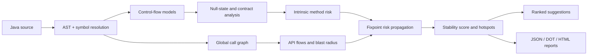

# NullGuard

NullGuard is a static stability-analysis engine for Java services. It parses a codebase, builds control-flow and call graphs, follows risk across method boundaries, identifies API-facing and high-blast-radius hotspots, calculates a project stability score, and produces prioritized remediation suggestions.

It is intended to answer questions that are difficult to answer with a method-level nullability warning alone:

- Where can a nullable value travel after it is introduced?
- Which controller, service, repository, or shared utility amplifies the most risk?
- Which REST endpoints can be affected by a risky downstream method?
- Which small set of fixes should a team prioritize first?
- Should a build be allowed to pass when a critical architectural hotspot is present?

NullGuard performs static analysis only. It does not instrument or run the analyzed application.

> **Project status:** the current version is `1.0-SNAPSHOT` and is built from source. The artifacts are not yet published to Maven Central.

## Why use NullGuard in microservices?

Microservices often have shallow-looking controller methods that call several services, repositories, clients, mappers, and shared libraries. A null-safety problem deep in that chain can affect multiple endpoints while remaining hard to prioritize from isolated compiler or linter warnings.

NullGuard adds a project-level view:

| Capability | Developer benefit |
| --- | --- |
| AST and symbol-aware parsing | Resolves overloaded methods, project types, inheritance, interfaces, JDK calls, and dependency calls more accurately than text matching alone. |
| Null-state and contract analysis | Highlights unsafe dereferences, nullable return paths, missing guards, and contract weaknesses. |
| Global call graph | Shows how risk travels across controller, service, repository, utility, and external-call boundaries. |
| API flow discovery | Connects annotated Spring MVC and JAX-RS entry points to downstream reachable methods. |
| Fixpoint risk propagation | Carries downstream risk back through callers until scores converge. |
| Blast-radius analysis | Finds risky methods used by many callers or API paths, which are usually the best fixes to make first. |
| Stability score and grade | Gives teams a repeatable project-level signal for reviews and CI. |
| Ranked suggestions | Recommends null guards, stronger contracts, external-return validation, risk-chain isolation, and hotspot refactoring. |
| JSON, DOT, and HTML reports | Supports machine processing, graph visualization, and human review. |
| Configurable build gate | Lets a team introduce reporting first and enable enforcement later. |

## How the analysis works



The stability index is based on the average adjusted method risk:

```text
adjusted risk = intrinsic risk + propagated risk + API exposure weight + contract penalty
stability index = 100 - average adjusted risk
```

The index is clamped to `0–100` and assigned a grade:

| Stability index | Grade |
| --- | --- |
| 90–100 | A |
| 80–89.99 | B |
| 70–79.99 | C |
| 60–69.99 | D |
| Below 60 | F |

Risk levels use one shared scale throughout the engine:

| Risk score | Level |
| --- | --- |
| 0–39 | LOW |
| 40–59 | MEDIUM |
| 60–79 | HIGH |
| 80+ | CRITICAL |

An empty analysis is reported as `N/A`, not as a perfect score. This prevents parse or pipeline failures from being mistaken for a clean project.

## Requirements

- JDK 17 or newer
- Maven 3.8+ (`3.9.x` recommended)
- A Java source tree to analyze
- Graphviz only if you want to render the generated `.dot` graph as SVG or PNG

Check the local toolchain:

```bash
java -version
mvn -version
```

## Build and test NullGuard

Clone and verify the complete multi-module project:

```bash
git clone https://github.com/techbhaskar/null-guard.git
cd null-guard
mvn clean verify
```

The build runs all module tests and creates the standalone CLI at:

```text
nullguard-cli/target/nullguard-cli-1.0-SNAPSHOT-jar-with-dependencies.jar
```

Install the snapshot into your local Maven repository before using the Maven plugin from another project:

```bash
mvn clean install
```

## Recommended usage: Maven plugin

The Maven plugin is the simplest and most accurate way to analyze a Maven-based service. It automatically receives the project's compile source roots and compile classpath, which improves symbol resolution for dependency calls and overloaded methods.

### Run once from the command line

After installing NullGuard locally, run this command from the Java service you want to analyze:

```bash
mvn com.nullguard:nullguard-maven-plugin:1.0-SNAPSHOT:analyze
```

To analyze one NullGuard module as a smoke test:

```bash
mvn -f nullguard-core/pom.xml com.nullguard:nullguard-maven-plugin:1.0-SNAPSHOT:analyze -Dnullguard.failBuild=false
```

### Add it to a service build

Add the plugin to the target service's `pom.xml`:

```xml
<build>
    <plugins>
        <plugin>
            <groupId>com.nullguard</groupId>
            <artifactId>nullguard-maven-plugin</artifactId>
            <version>1.0-SNAPSHOT</version>
            <executions>
                <execution>
                    <id>nullguard-analysis</id>
                    <phase>verify</phase>
                    <goals>
                        <goal>analyze</goal>
                    </goals>
                </execution>
            </executions>
            <configuration>
                <!-- Start in report-only mode, then enable the build gate. -->
                <failBuild>false</failBuild>
                <failThreshold>CRITICAL</failThreshold>
                <highRiskThreshold>60</highRiskThreshold>
            </configuration>
        </plugin>
    </plugins>
</build>
```

Now the analysis runs during Maven's `verify` phase:

```bash
mvn verify
```

You can override plugin settings without changing the POM:

In PowerShell, quote each Maven property argument, for example `"-Dnullguard.failBuild=true"`, to prevent native argument parsing from splitting dotted property names.

```bash
mvn verify -Dnullguard.failBuild=true -Dnullguard.failThreshold=HIGH
```

### Maven plugin options

| Configuration element | Command-line property | Default | Meaning |
| --- | --- | ---: | --- |
| `failBuild` | `nullguard.failBuild` | `false` | Fail the Maven build when a hotspot reaches the configured severity. |
| `failThreshold` | `nullguard.failThreshold` | `CRITICAL` | Minimum failing severity: `LOW`, `MODERATE`, `HIGH`, or `CRITICAL`. |
| `scoringDecayFactor` | `nullguard.scoringDecayFactor` | `0.85` | Amount of downstream risk carried to a caller. Must be at least 0 and strictly less than 1. |
| `externalPenaltyMultiplier` | `nullguard.externalPenaltyMultiplier` | `1.2` | Risk multiplier applied to calls outside the analyzed project. |
| `convergenceThreshold` | `nullguard.convergenceThreshold` | `0.001` | Score delta below which fixpoint propagation is considered stable. |
| `maxScoringIterations` | `nullguard.maxScoringIterations` | `100` | Safety limit for propagation iterations. |
| `highRiskThreshold` | `nullguard.highRiskThreshold` | `60` | Score from `0–100` used to count high-risk methods. |

The plugin writes reports to `target/nullguard/` in the analyzed service.

## Standalone CLI

Use the CLI for local exploration, scripts, or source trees that are not being invoked through Maven.

### Basic run

From the NullGuard repository:

```bash
java -jar nullguard-cli/target/nullguard-cli-1.0-SNAPSHOT-jar-with-dependencies.jar path/to/service/src/main/java
```

Choose a report directory and enable a CI-style failure policy:

```bash
java -jar nullguard-cli/target/nullguard-cli-1.0-SNAPSHOT-jar-with-dependencies.jar \
  path/to/service/src/main/java \
  --output=build/nullguard \
  --fail-build \
  --fail-threshold=HIGH
```

PowerShell uses a backtick for line continuation:

```powershell
java -jar nullguard-cli/target/nullguard-cli-1.0-SNAPSHOT-jar-with-dependencies.jar `
  C:\work\orders-service\src\main\java `
  --output=C:\work\orders-service\target\nullguard `
  --fail-build `
  --fail-threshold=HIGH
```

### Supply dependencies for symbol resolution

For best results, supply the service's compiled classes and dependency JARs with `--classpath`. Entries use the operating system's path separator: `;` on Windows and `:` on Linux/macOS.

```powershell
java -jar nullguard-cli/target/nullguard-cli-1.0-SNAPSHOT-jar-with-dependencies.jar `
  C:\work\orders-service\src\main\java `
  "--classpath=C:\work\orders-service\target\classes;C:\libs\shared-contracts.jar"
```

```bash
java -jar nullguard-cli/target/nullguard-cli-1.0-SNAPSHOT-jar-with-dependencies.jar \
  /work/orders-service/src/main/java \
  --classpath=/work/orders-service/target/classes:/work/libs/shared-contracts.jar
```

If a call cannot be resolved semantically, NullGuard keeps the analysis running and falls back to name-and-arity matching. Supplying a complete classpath reduces ambiguous or external fallback nodes.

### CLI options

| Option | Default | Meaning |
| --- | ---: | --- |
| `--output=<dir>` | `./nullguard-out` | Directory for generated JSON and DOT reports. |
| `--classpath=<paths>` | empty | Dependency JARs and class directories separated by the platform path separator. |
| `--fail-build` | disabled | Return exit code `1` when the severity threshold is breached. |
| `--fail-threshold=<level>` | `CRITICAL` | Minimum failing hotspot severity: `LOW`, `MODERATE`, `HIGH`, or `CRITICAL`. |
| `--decay-factor=<number>` | `0.85` | Risk propagation decay factor. |
| `--ext-penalty=<number>` | `1.2` | External-call penalty multiplier. |
| `--convergence=<number>` | `0.001` | Fixpoint convergence threshold. |
| `--max-iterations=<number>` | `100` | Maximum propagation iterations. |
| `--high-risk-threshold=<0-100>` | `60` | Score used to classify methods as high-risk. |

CLI exit codes:

| Exit code | Meaning |
| ---: | --- |
| `0` | Analysis completed and no enabled policy was breached. |
| `1` | `--fail-build` was enabled and the hotspot threshold was breached. |
| `2` | Invalid arguments or a missing source path. |
| `3` | Analysis failed with an exception. |

## Reports

### Maven plugin output

The plugin writes both timestamped history and stable `latest` files:

```text
target/nullguard/
├── nullguard-dashboard-latest.html
├── nullguard-dashboard-YYYYMMDD_HHMMSS.html
├── nullguard-report-latest.json
├── nullguard-report-YYYYMMDD_HHMMSS.json
├── nullguard-graph-latest.dot
├── nullguard-graph-YYYYMMDD_HHMMSS.dot
└── nullguard-results.sarif
```

- **HTML dashboard** — stability summary, risk distribution, API flows, hotspots, method explorer, risk reasons, and suggestions.
- **JSON report** — schema version `1.0`, project summary, graph, source-linked findings, API endpoints, hotspots, and suggestions.
- **SARIF report** — `nullguard-results.sarif`, version `2.1.0`, with stable rule IDs and source locations for CI and editor consumers.
- **DOT graph** — call/risk propagation graph, with external methods rendered as boxes and nodes colored by risk.

The CLI writes `nullguard-report-latest.json`, `nullguard-graph-latest.dot`, and `nullguard-results.sarif` to the selected output directory. The HTML dashboard is currently generated by the Maven plugin only.

To render the DOT graph with Graphviz:

```bash
dot -Tsvg target/nullguard/nullguard-graph-latest.dot -o target/nullguard/nullguard-graph-latest.svg
```

### Reading the results

Review results in this order:

1. Confirm that the report contains methods and does not show grade `N/A`.
2. Check the stability index and high-risk method count for the broad health signal.
3. Review `CRITICAL` and `HIGH` architectural hotspots.
4. Use API flow and impact information to identify customer-facing paths.
5. Apply the highest-ranked suggestions to shared or high-blast-radius methods first.
6. Re-run the analysis and compare the score and hotspot count.

Treat the score as a prioritization signal, not proof that an application is correct. Static analysis cannot see every runtime value, reflection path, generated source, framework proxy, or environment-specific behavior.

## Suggested CI adoption

Introduce NullGuard gradually so existing services can establish a baseline before enforcement:

1. **Observe:** run with `failBuild=false`, publish the HTML/JSON artifacts, and inspect false positives or missing classpath entries.
2. **Stabilize:** fix critical shared methods and validate external or nullable returns at service boundaries.
3. **Gate critical risk:** set `failBuild=true` and `failThreshold=CRITICAL`.
4. **Tighten deliberately:** move to `HIGH` only after the team agrees on the expected quality bar.

Example CI command:

```bash
mvn --batch-mode verify \
  -Dnullguard.failBuild=true \
  -Dnullguard.failThreshold=CRITICAL
```

Archive `target/nullguard/` as a CI artifact even when the build fails; the dashboard explains what triggered the gate.

## Microservice usage guidance

- Run the plugin inside each independently built service so it receives that service's real dependency graph.
- Include shared internal libraries on the compile classpath; this improves resolution of client contracts and utility calls.
- Pay special attention to controller-to-service-to-repository paths and calls to HTTP clients, SDKs, databases, caches, and message payload mappers.
- Prefer guarding or strengthening a shared boundary once over adding repeated defensive checks in every controller.
- Use hotspot severity for build policy and use the ranked suggestion list for remediation order.
- Keep report-only mode for generated code or unusual framework-heavy modules until the team has reviewed the analysis quality.

## Architecture and modules

NullGuard is a Maven multi-module project with one-way pipeline dependencies and manual constructor injection.

| Module | Responsibility |
| --- | --- |
| `nullguard-core` | Java parsing, symbol resolution, project model, instructions, and control-flow construction. |
| `nullguard-callgraph` | Internal/external call resolution and the global call graph. |
| `nullguard-analysis` | Null-state propagation, summaries, contracts, API flow discovery, and hotspot detection. |
| `nullguard-scoring` | Risk models, fixpoint propagation, stability index, grade, and blast-radius metrics. |
| `nullguard-suggestions` | Remediation rules and deterministic suggestion ranking. |
| `nullguard-visualization` | Propagation graph construction plus JSON and Graphviz DOT export. |
| `nullguard-maven-plugin` | Pipeline assembly, Maven integration, fail policy, and HTML report generation. |
| `nullguard-cli` | Standalone command-line entry point and exit-code policy. |
| `nullguard-coverage` | Combines coverage from module tests and integration tests into one reactor report. |

The runtime pipeline is:

```text
parse
  -> call graph
  -> null-state, contract, API, and hotspot analysis
  -> risk propagation
  -> stability scoring
  -> suggestions
  -> visualization export
  -> integrity validation
```

See the versioned design documents for more detail:

- [Architecture v1.1](docs/versions/nullguard_architecture_v1_1.md)
- [Architecture v1.0](docs/versions/nullguard_architecture.md)

## API entry-point discovery

NullGuard recognizes common Spring MVC and JAX-RS mappings, including:

```text
@GetMapping  @PostMapping  @PutMapping  @DeleteMapping  @PatchMapping
@RequestMapping
@Path  @GET  @POST  @PUT  @DELETE  @PATCH
```

Entry points require a mapping annotation; class names alone do not qualify. Private and protected methods are excluded. The current traversal produces a deterministic reachability list with cycle protection, rather than a separate ordered path for every branch. Complex mappings, class-level path composition, and runtime proxy routing remain limitations.

## Current scope and limitations

The current release focuses on source-based Java service analysis.

- Java source is analyzed; Kotlin and bytecode-only application analysis are not supported.
- Dependency JARs and class directories improve symbol resolution, but only project source methods receive full source-level analysis.
- Reflection, dynamic proxies, runtime dependency injection choices, and generated methods may create call paths that static analysis cannot resolve.
- API discovery currently targets common Spring MVC/JAX-RS conventions and controller/resource naming.
- The CLI emits JSON and DOT; use the Maven plugin for the HTML dashboard.
- SARIF and source-linked findings are available. Dedicated IDE integration, incremental analysis, and automatic source rewriting are not implemented yet.
- NullGuard is not a CVE scanner, dependency vulnerability scanner, SBOM generator, or replacement for tests and runtime observability.

## Using this repository with Google Code Wiki

This repository is structured so [Google Code Wiki](https://codewiki.google/) can use the root README as the entry point and the versioned architecture documents as deeper design context.

After these changes are pushed to GitHub:

1. Add or select `techbhaskar/null-guard` in Code Wiki.
2. Start with this README for setup, execution, outputs, and limitations.
3. Use `docs/versions/nullguard_architecture_v1_1.md` for the pipeline and domain model.
4. Ask architecture questions using the module names above so generated answers can map directly to the source tree.

Keep the README focused on how developers use the tool, and keep detailed architectural decisions under `docs/`. That separation gives both repository visitors and generated documentation a clear navigation path.

## Development workflow

`mvn verify` generates JaCoCo HTML/XML coverage reports under each module's `target/site/jacoco/` and an aggregate report at `nullguard-coverage/target/site/jacoco-aggregate/index.html`. The aggregate includes coverage of upstream modules exercised by integration tests. GitHub Actions enforces at least 80% aggregate instruction coverage and 60% branch coverage, defines JDK 17 and 21 builds on Linux and Windows, tests the packaged CLI and Maven goal, validates SARIF against the OASIS schema, and archives reports. Local Maven builds measure coverage; run the Python coverage command with the same minimum flags to enforce the CI gate locally.

After `mvn install`, run the process-level smoke tests and coverage summary locally:

```bash
python scripts/smoke_entrypoints.py
python scripts/summarize_coverage.py
```

For independent SARIF schema validation, install the verification dependency in a Python virtual environment and run:

```bash
python -m pip install jsonschema==4.23.0
python scripts/validate_sarif.py nullguard-cli/target/ci-reports/nullguard-results.sarif
```

Run the checked-in sample service after installing NullGuard:

```bash
mvn -f examples/orders-service/pom.xml com.nullguard:nullguard-maven-plugin:1.0-SNAPSHOT:analyze -Dnullguard.failBuild=true -Dnullguard.failThreshold=HIGH
```

This intentionally risky fixture should fail the gate while writing reports. It uses minimal annotation stand-ins for testing source analysis, rather than running an HTTP server.

The companion `examples/catalog-service/src/main/java` fixture uses JAX-RS-style `@GET`/`@Path` annotations and a safe return. It verifies that a service with no hotspots passes even when the gate is enabled.

Run the opt-in pipeline benchmark:

```bash
mvn verify -Dnullguard.benchmark=true
```

Measurements for 10, 100, and 500 methods, including warmup and three samples per size, are written to `nullguard-maven-plugin/target/benchmark.json`. Heap usage is a sampled observation, not peak memory. These measurements do not establish the historical 50k-method scalability target.

See [the recorded benchmark observations](docs/performance_baseline.md) for the initial local baseline and its limits.

Run the full verification suite before opening a change:

```bash
mvn clean verify
```

Run one module and its required upstream modules:

```bash
mvn -pl nullguard-callgraph -am test
```

Package only the standalone CLI after dependencies are already built:

```bash
mvn -pl nullguard-cli -am package
```

When changing analysis behavior, add focused tests in the owning module and run the full reactor before considering the change complete. Output ordering is intentionally deterministic so report diffs remain reviewable.

## Troubleshooting

### The report says `N/A` or contains no methods

- Confirm the argument points to a directory containing `.java` files.
- For Maven, confirm `${project.build.sourceDirectory}` exists.
- Read parser warnings in the console.
- Ensure the source level can be parsed by the bundled JavaParser version.

### Too many calls appear as external or unresolved

- Prefer the Maven plugin, which supplies the compile classpath automatically.
- With the CLI, pass dependency JARs and compiled class directories through `--classpath`.
- Build the target service first so its `target/classes` directory exists.

### The Maven goal cannot be resolved

The plugin is a snapshot and must first be installed locally:

```bash
cd path/to/null-guard
mvn clean install
```

Then use the fully qualified goal from the target project:

```bash
mvn com.nullguard:nullguard-maven-plugin:1.0-SNAPSHOT:analyze
```

### The build fails after enabling NullGuard

Open `target/nullguard/nullguard-dashboard-latest.html`, review hotspots at or above `failThreshold`, and either fix the risky path or temporarily return to report-only mode while establishing a baseline:

```bash
mvn verify -Dnullguard.failBuild=false
```

## Roadmap

High-value next steps include:

- OpenAPI generation and Swagger UI in the unified developer portal
- More precise framework metadata and class-level API path composition
- Framework-aware dependency-injection and proxy resolution
- Baseline/diff mode so CI can gate only newly introduced risk
- Multi-module aggregation and cross-service contract modeling
- IDE integrations and source-linked navigation
- Incremental analysis and caching for large repositories

